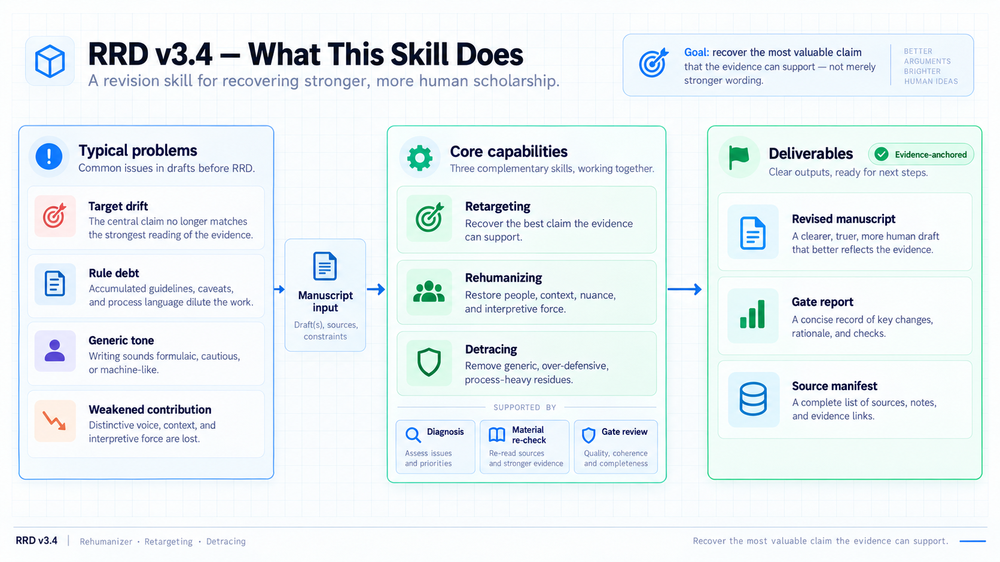
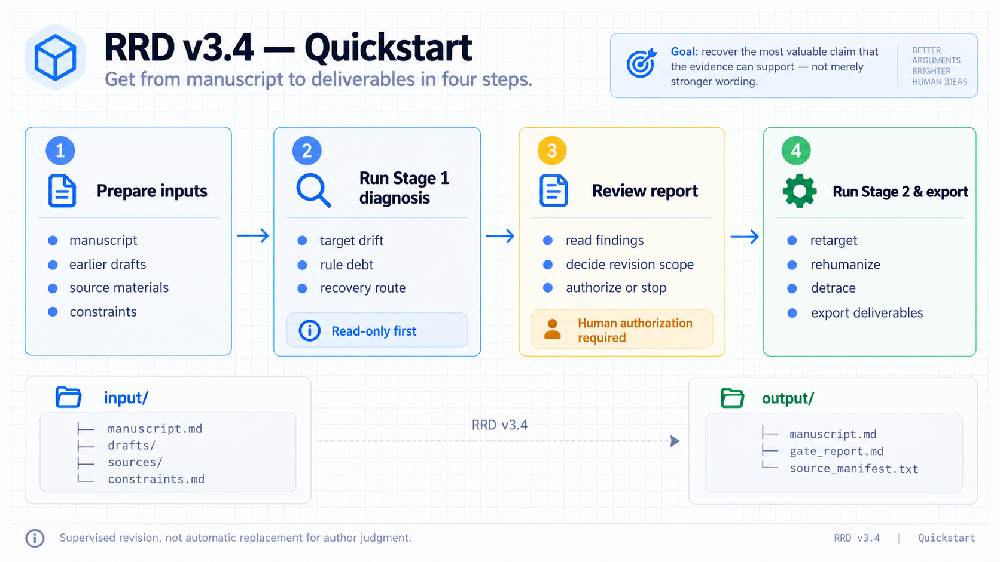
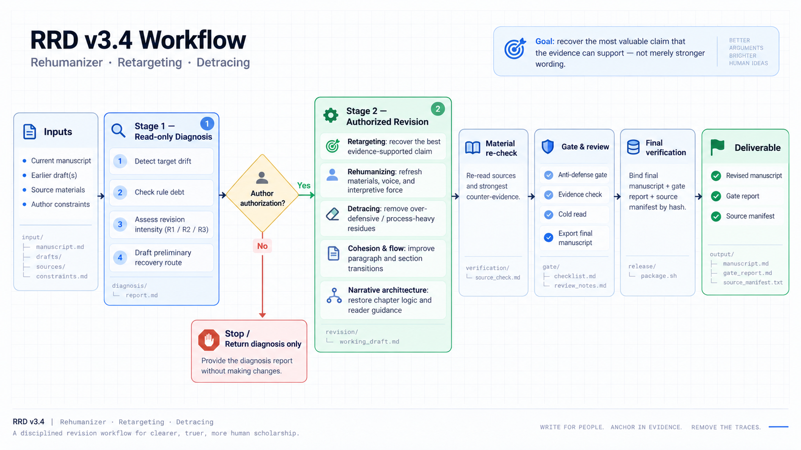
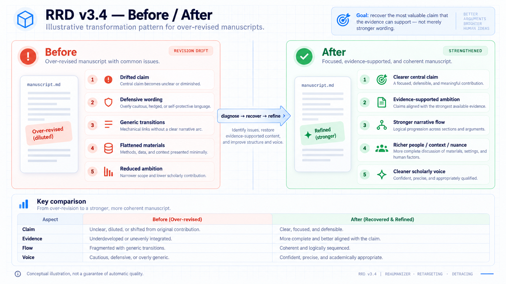
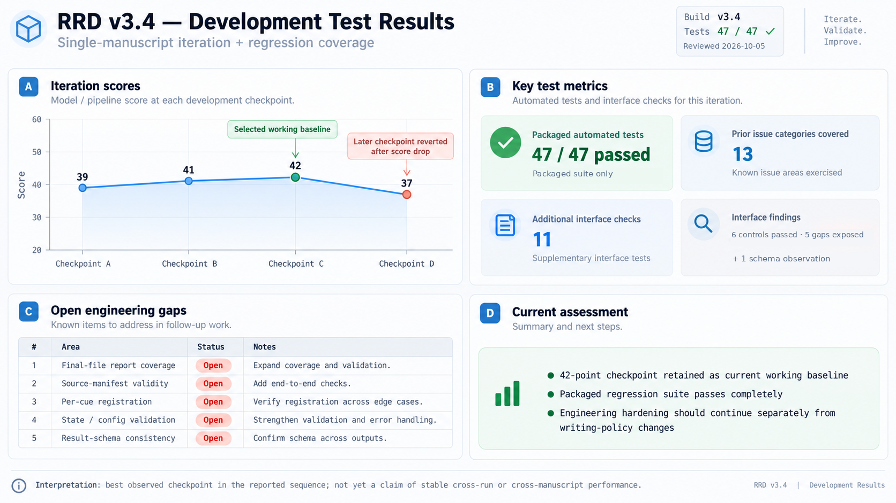

# Rehumanizer · Retargeting · Detracing（RRD）

**恢复证据能够支持、且最有研究价值的学术主张。**

[English](README.md) · [下载纯 skill 安装包](downloads/rrd-v3.4-skill.zip) · [Skill完整规范](SKILL.md) · [中文开发测试记录](docs/review-20261005/DEVELOPMENT_TEST_LOG.zh-CN.md) · [已知限制](docs/KNOWN_LIMITATIONS.md)

<p align="center"></p>

RRD面向已有完整稿件、但在反复修改中出现研究靶点漂移、贡献弱化、材料失活、语句断裂或流程痕迹的情形。它不是规避AI检测的工具，也不替代作者的研究判断。

**版本：** v3.4　**使用状态：** 受监督的工作基线　**工程验收加固：** 待完成　**许可证：** 待作者决定，本包未擅自添加。

## 主要功能



| 功能 | 目标 |
| --- | --- |
| 重定位 | 恢复材料能够支持的最佳研究主张，不机械回到最早、最强或范围最大的版本。 |
| 恢复人的研究判断与表达 | 重读原始材料，恢复行动者、情境、作者立场、解释深度、段落衔接与章节组织。 |
| 清理机械化修订痕迹 | 删除模板化、流程化及不必要的防御性表达，保留必要限定与反面证据。 |

配图用于概念说明，不是接口规范。图中的目录树经过简化；实际执行以[SKILL.md](SKILL.md)为准，`final_check.py`使用的来源清单是CSV，而不是图中示意的TXT。

## 快速开始



按照所用agent环境的安装说明，将本目录配置为可访问的本地skill。检查脚本需要Python；Markdown、TXT是最直接的扫描输入，其他文档格式的读取依赖相应组件。完整回归测试使用`python-docx`。

1. 准备当前稿件、可用的早期稿、原始材料与作者约束。私有研究资料应放在公开仓库之外。
2. 显式调用`$rehumanizer-retargeting-detracing-skill`，先执行Stage 1，只读诊断，不修改原稿。
3. 作者审阅恢复的研究靶点、拟放宽或保留的约束，以及改写强度，并作出授权决定。
4. 在新的对话中使用生成的Goal与启动提示执行Stage 2。先回读材料和反证、复核靶点，再改写与核验，最后在终稿导出后重新运行检查。

Stage 1启动示例：

```text
使用 $rehumanizer-retargeting-detracing-skill，仅执行 Stage 1。
只读诊断所提供的稿件，不修改原文。
恢复证据支持的最佳研究靶点，审查既有约束，
生成诊断报告、GOAL.md 与 SHORT_LAUNCH_PROMPT.md。
只询问会实质影响改写路线的作者决策。
```

在本仓库根目录运行脚本帮助与测试：

```bash
python scripts/trace_scan.py --help
python scripts/defense_gate.py --help
python scripts/final_check.py --help
python -m unittest discover -s tests -v
```

这些脚本负责检查和验证，不会自行调用语言模型、自动完成全文改写。

## 流程与预期变化



完整Stage 2要求在主体改写之前回读材料、检查最强反证并复核靶点；示意图压缩了步骤，实际执行应遵循skill规范和Goal模板。



这是一张预期变化示意图，不是真实稿件的配对效果证据。证据要求收窄时，收窄同样可能提高贡献质量；范围更大、限定更少不等于学术性更强。

## 评测与开发状态



| 证据层次 | 已记录结果 | 解释边界 |
| --- | --- | --- |
| 开发者报告的真实稿件评测 | 39→41→42→37；保留42分检查点 | 同一稿件；未提供满分、完整量表与同检查点重复运行结果。 |
| 2026-10-05存档工程审查 | 包内47项测试全部通过 | 已编码的合成场景，不是稿件质量得分或实时CI结果。 |
| 额外接口检查 | 6个正常对照符合预期，5个负向场景暴露缺口，另有1项结构观察 | 验收接口仍待加固。 |

测试图将6项观察归为5个主题行，其中状态与配置问题共用一行。图中的A—D对应记录内部B01—B04，不代表实际Git提交。不得把42分换算为百分制，不报告统计显著性或跨稿件稳定效果。本次发布整理没有重跑47项测试，也没有新生成真实稿件修订版。

详见[中文记录](docs/review-20261005/DEVELOPMENT_TEST_LOG.zh-CN.md)、[英文记录](docs/review-20261005/DEVELOPMENT_TEST_LOG.en.md)、[测试汇总](docs/review-20261005/evidence/test_summary.json)及[评分元数据](docs/review-20261005/benchmark_history.developer_reported.json)。

## 仓库结构与维护

`SKILL.md`是agent入口；`references/`保存八份方法与写作规范；`assets/templates/`保存Goal、登记表和结果模板；`scripts/`保存六个检查脚本；`tests/`保存合成回归测试；`docs/`保存六张图、历史审查记录与已知限制。

事实、来源保护、匿名、知情同意和反证要求不因改写而放宽。不得虚构引用、数字、动机或结果。公开报告问题时应使用合成或已获适当授权的材料，不上传未发表稿件和参与者资料。

建议将写作策略修改与工程修补分开提交，为缺陷增加复现测试，不通过放松检查配置制造PASS。

## 许可证与发布状态

提供的v3.4制品不含许可证，本次整理未擅自添加。具体开源许可证由作者决定。源码现通过本仓库公开提供；本次发布不创建 Release 或版本标签。历史测试记录与 GitHub Actions 的当前运行结果分别记录，不相互替代。
